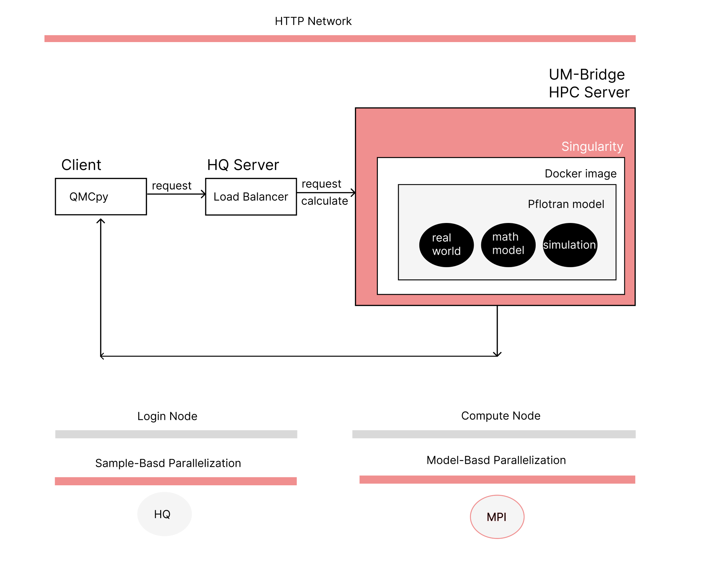
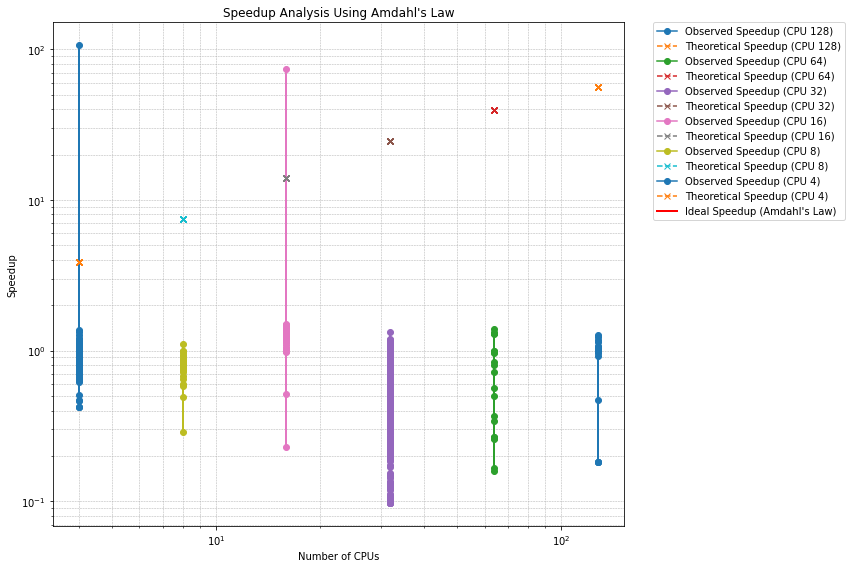
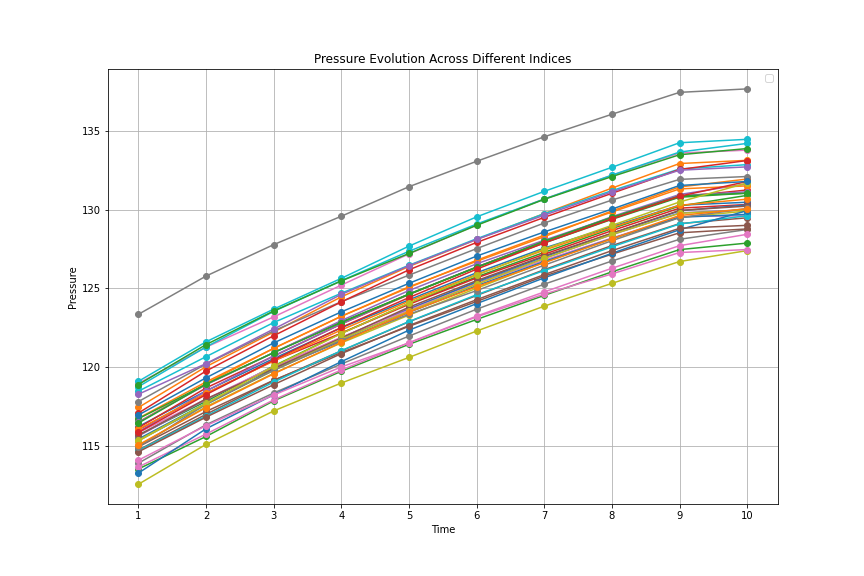
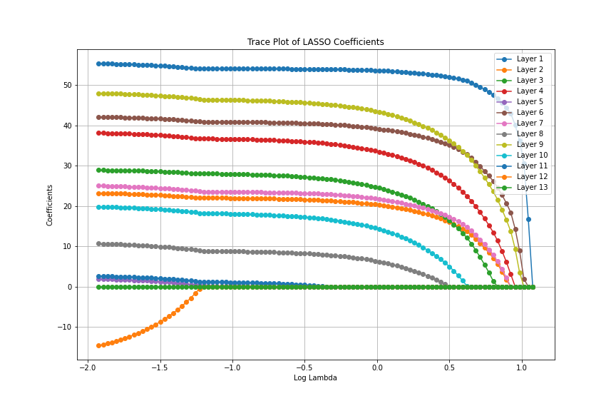

# QMCPy with UM-Bridge model demo


This is a demo for running QMCPy with UM-Bridge model on HPC.

# Introduction
This project explores the computational efficiency of Quasi-Monte Carlo
methods for quantifying uncertainty in Reservoir Engineering, 
specifically within the European North Sea regions. 
By applying a robust Uncertainty Quantification (UQ)
framework developed by UM-Bridge,
we utilized High-Performance Computing (HPC) systems 
to analyze large-scale synthetic data generated by the Fortran model.

Our primary focus was on evaluating the influence of
uncertainty on various parameters using established 
benchmarks, including probabilistic analyses of algorithms.
We collaborated closely with industry partners OpenGo Simulations to enhance their subsurface carbon dioxide storage software.



### Network Control
### Seperation of Concerns
### Inner Architecture
### Scalability Analysis


* [Scalability](http://htmlpreview.github.io/?https://github.com/Amberisfree/UQ/blob/master/VIsualization/CPUs-time.html)



* [Evolution](http://htmlpreview.github.io/?https://github.com/Amberisfree/UQ/blob/master/VIsualization/Evolution.html)


* [Feature Importance](http://htmlpreview.github.io/?https://github.com/Amberisfree/UQ/blob/master/VIsualization/INPUT_TIME.html)


## 1. Install dependencies
### Pull Dockerfile and Build the Docker image 

``` bash
sudo docker build -t opengo .&&
docker image save opengo -o opengo.tar &&
scp opengo.tar hamilton:/nobackup/[username]/workspace
```


### Build the Singularity image 
``` bash
module load singularity
singularity --version
SINGULARITY_CACHEDIR=$NOBACKUP singularity build --sandbox opengo docker-archive://opengo.tar 
```

### Get HQ
``` bash
wget https://github.com/It4innovations/hyperqueue/releases/download/v0.19.0/hq-v0.19.0-linux-x64.tar.gz
```
``` bash
tar -xzf hq-v0.19.0-linux-x64.tar.gz
```


## 2. Run the UM-Bridge HPC server with HQ

#### Using MPI platform: openMPI
``` bash
module load gcc openmpi
```
``` bash
cd /umbridge/hpc
```
#### Run the server by executing the following command of Load Balancer
#### The Load Balancer is a python script that is used to manage the server.

``` bash
export PATH=$(pwd):$PATH &&
PORT=[4242] ./load-balancer
```

#### Run the client
``` bash
python3 qmcpy-client.py http://localhost:[PORT]
```
## 3. Sbatch Job to SLURM
#### this step simplifies running the server by executing the following command of Load Balancer
#### Slurm script also incorporates the client and server into one script
``` bash
sbatch slurm-job.sh
``` 

## 4. Some useful commands for Debugging

### Some useful commands for HQ
``` bash
./hq alloc list

sacct -o jobid,elapsed,reqcpus -j [10618772]

sinfo --help

ls urls

nano umbridge/hpc/hq_scripts/job.sh

nano umbridge/hpc/hq_scripts/allocation_queue.sh
```

### Some useful commands for Singularity
``` bash
singularity shell --writable opengo
PORT=[4242] singularity run --no-home --writable opengo
```

### some useful commands for HPC
``` bash
squeue -u [username]
scancel id [jobid]
srun -p shared --pty /bin/bash
module load gcc openmpi
module list

sacct -j $JOB_ID -D -o jobid,state,totalcpu,cputime,avecpu,reqcpus,ncpus,reqmem,maxvmsize,maxdiskwrite,maxdiskread,maxrss --units=G
```

#### Time One Simulation 

``` bash

cd ../../ && cd nobackup/[username]/workspace
PORT=4296 singularity run --no-home --writable opengo python3 app/server.py --pty bash
time curl http://localhost:4296/Evaluate -X POST -d '{"name":  "pflotran_simulation" , "input": [[0.5,0.5,0.5,0.5,0.5,0.5,0.5,0.5,0.5,0.5,0.5,0.5]] }'
```


#### Check job/server/client log
``` bash
./hq job list --all
./hq job info 1
cat sub-jobs/hq-job-1.err
cat server.err
cat server.out
cat client.err
cat client.out
```

## Reference


#### Python QMCPy
https://qmcpy.readthedocs.io/en/master/index.html

#### UM-Bridge HPC Server
https://um-bridge-benchmarks.readthedocs.io/en/docs/umbridge/hpc.html

#### HyperQueue 
https://it4innovations.github.io/hyperqueue/stable/jobs/multinode/#running-mpi-tasks

#### Pflotran OPENGO Geo-physics Model
https://docs.opengosim.com/

#### Slurm and Hamilton
https://www.durham.ac.uk/research/institutes-and-centres/advanced-research-computing/hamilton-supercomputer/usage/jobs/

#### OPENMPI MPIRUN
https://www.open-mpi.org/doc/v4.0/man1/mpirun.1.php

#### Scalability Analysis
https://researchcomputing.princeton.edu/support/knowledge-base/scaling-analysis


